# Arquitectura — koeti-mvp-factory

Diagramas vivos del factory. `@koeti/ai` está marcado como **planned** (aún no
existe en `packages/`). Todo lo demás refleja el repo actual.

---

## 1. Topología de despliegue (dónde corre cada cosa + servicios externos)

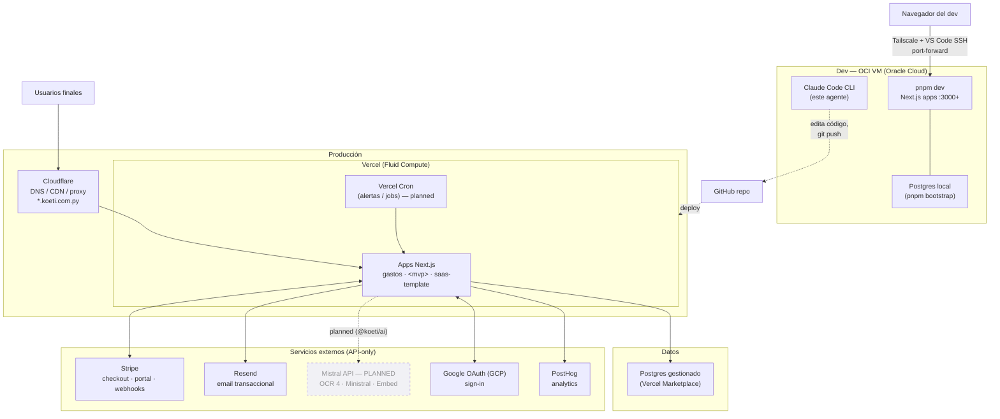

---

## 2. Grafo de dependencias del monorepo (packages ↔ apps)

Regla de oro: **las apps importan solo de `@koeti/*`; nunca de otra app.**

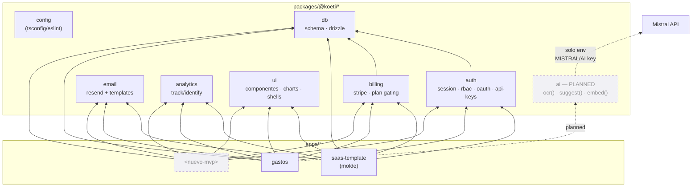

`config` es dev-only (extendido por tsconfig/eslint, no import runtime). `ui`,
`email`, `analytics`, `ai` no dependen de `db` — son hojas. `db` es la raíz.

---

## 3. Modelo de datos (ERD — packages/db/src/schema.ts)

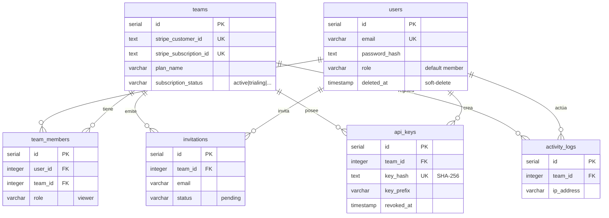

Las tablas de negocio de cada MVP (ej. `gastos`) añaden su propio schema con
columna `team_id` → así `crudActions` las scope-a automáticamente por equipo.

---

## 4. Flujo de auth + sesión (sign-in / OAuth / request scope-ado)

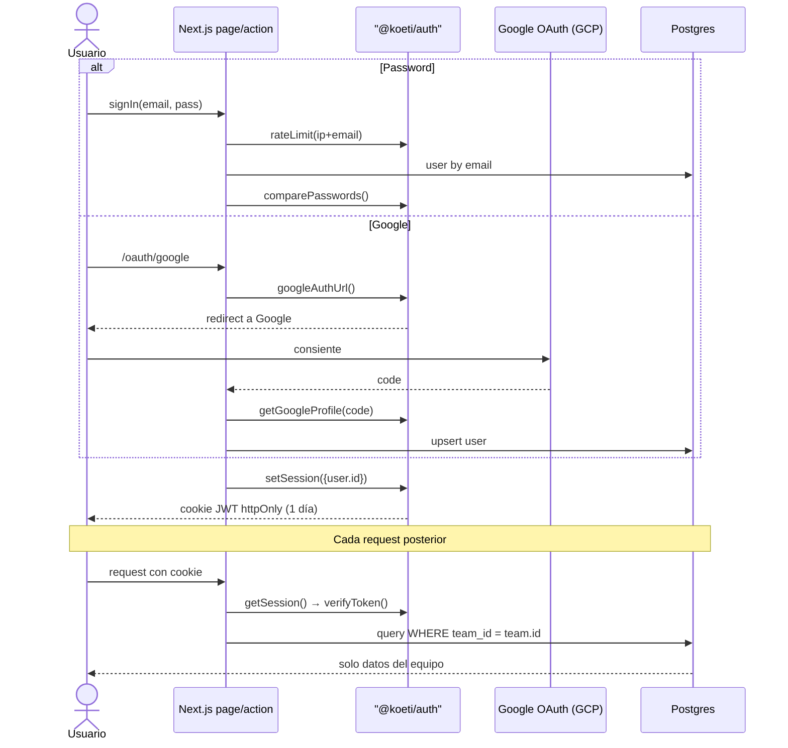

---

## 5. Capa de IA — OCR de recibo (planned, gastos como primer consumidor)

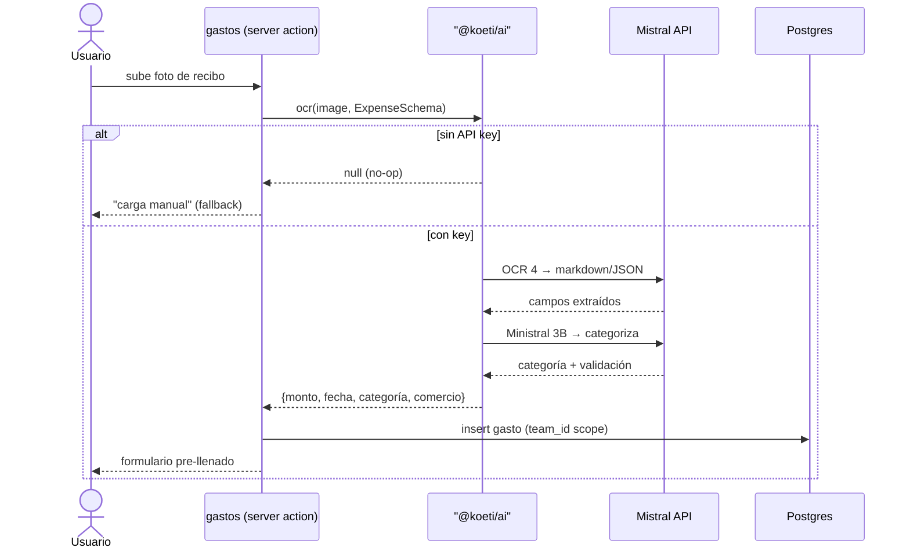

Patrón no-op-sin-key idéntico a `@koeti/email` y `@koeti/analytics`: sin
`MISTRAL/AI` key, `ocr()` devuelve `null` y el MVP cae a carga manual.

---

## 6. Ciclo del factory (cómo nace un MVP)

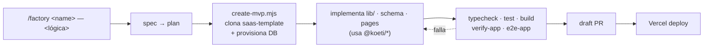

---

## 7. Billing — ciclo de vida Stripe (checkout · portal · webhook)

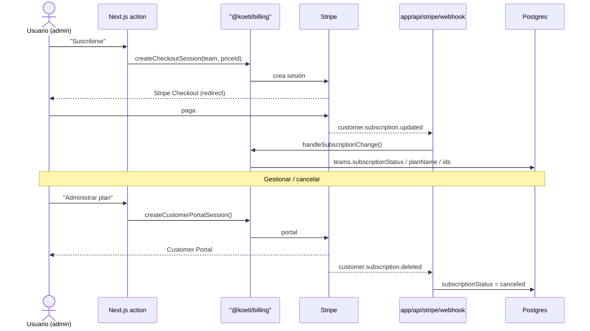

Gating de plan: `isSubscribed(team)` = `active || trialing`.
**Gap conocido:** el webhook solo maneja `subscription.updated/deleted` — falta
`invoice.payment_failed` y `checkout.session.completed`. Añadir cuando importe
el dunning (avisos de pago fallido).

---

## 8. Modelo de seguridad — RBAC + multi-tenancy (los invariantes)

Dos guardas se combinan en **cada** mutación: _quién sos_ (rol) y _de qué
equipo_ (tenant). Ninguna query de negocio corre sin ambos.

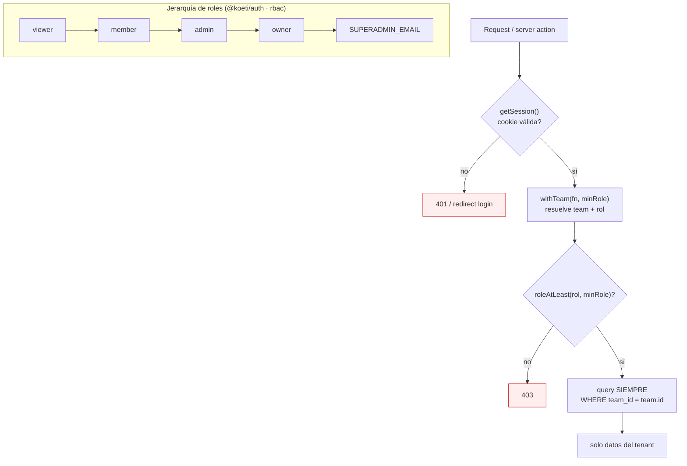

- **RBAC**: `requireRole('viewer')` en páginas, `withTeam(fn,'admin')` en
  actions. `crudActions` recibe `minRole` (default `member`).
- **Tenancy**: `crudActions` inyecta `team_id` en todo insert y lo filtra en
  update/delete → _olvidar el scope es imposible_. Las queries de lectura del
  MVP deben repetir el `WHERE team_id` a mano.
- **Superadmin**: `isSuperadmin(user)` por env `SUPERADMIN_EMAIL`, fuera de la
  jerarquía de equipo.

---

## 9. CRUD team-scoped (crudActions — el 80% de cada MVP)

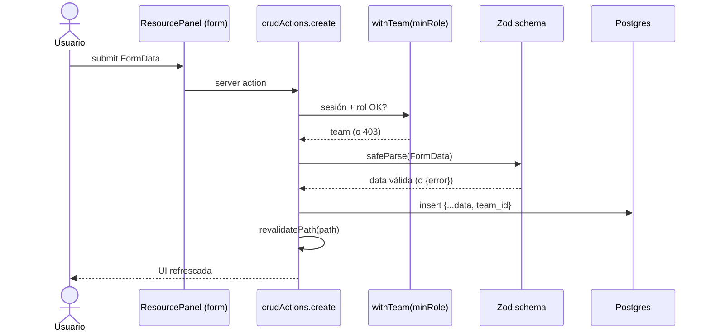

Entidades con lógica extra que el factory-CRUD no cubre → action escrita a mano
al lado, no forzar todo por `crudActions` (ver `.claude/rules/crud.md`).

---

## 10. Integración MVP ↔ MVP (sin importar código entre apps)

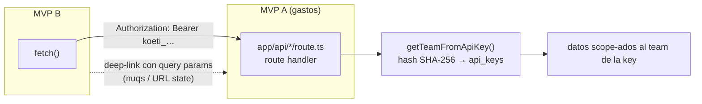

Dos únicas vías permitidas: **datos** por HTTP (route handlers + API key de
equipo minteada en `/dashboard/api-keys`) y **navegación** por deep-links con
estado en la URL. Nunca `import` de `apps/*`.
`api-rate-limit`: in-memory por instancia (ceiling conocido → Upstash si crece).

---

## Qué NO está documentado aquí (a propósito)

Se lee directo del código o de las reglas; documentarlo sería deuda:
estructura de carpetas (`CLAUDE.md`), estándares de código/imports (`CLAUDE.md`
§Package imports), patrones de charts/URL-state/CRUD (`.claude/rules/*.md`),
API exacta de cada package (los `index.ts`). Este doc solo captura lo
**transversal**: topología, dependencias e invariantes de seguridad.

---

---

# Manual del dev — cómo se opera el factory

Lo de arriba es _qué es_ el sistema. Lo de abajo es _cómo lo manejás_ vos y el
agente: las skills, las reglas que se auto-aplican, y el loop autónomo.

## 11. Catálogo de skills (`.claude/skills/*`)

Se invocan con `/<skill>`. Dos son loops de negocio (crean MVPs); el resto son
herramientas de trabajo apoyadas en el knowledge graph.

```mermaid
flowchart TB
  subgraph build["Crear / evolucionar producto"]
    factory["/factory &lt;name&gt; — &lt;lógica&gt;<br/>AFK: párrafo → MVP built + PR<br/>cero preguntas"]
    createsaas["/create-saas<br/>implementa desde spec+plan<br/>ya escritos por un humano"]
    port["/port-template-change<br/>propaga cambio de template/package<br/>a TODAS las apps (anti-drift)"]
  end

  subgraph work["Trabajo asistido por el graph"]
    explore["/explore-codebase<br/>navegar y entender estructura"]
    debug["/debug-issue<br/>debug sistemático"]
    refactor["/refactor-safely<br/>refactor con análisis de deps"]
    review["/review-changes<br/>code review + detect_changes"]
  end

  factory -. "reusa" .-> createsaas
  createsaas -. "tras editar template" .-> port
  work -. "graph MCP:<br/>query_graph · impact_radius" .-> graph[("code-review-graph")]
```

| Skill                  | Cuándo                             | Autónoma        |
| ---------------------- | ---------------------------------- | --------------- |
| `factory`              | Idea en un párrafo → MVP con PR    | Sí, 0 preguntas |
| `create-saas`          | Ya hay spec+plan escritos          | Semi            |
| `port-template-change` | Tocaste `saas-template`/`packages` | Semi            |
| `explore-codebase`     | Entender antes de tocar            | Herramienta     |
| `debug-issue`          | Algo falla                         | Herramienta     |
| `refactor-safely`      | Renombrar/mover con blast-radius   | Herramienta     |
| `review-changes`       | Revisar un diff/PR                 | Herramienta     |

## 12. Reglas que se auto-aplican por path (`.claude/rules/*`)

Cada regla declara `paths:` (globs). Cuando el agente toca un archivo que
matchea, la regla se inyecta en contexto **sin pedirla**. Así el patrón correcto
llega solo al editar la zona correcta.

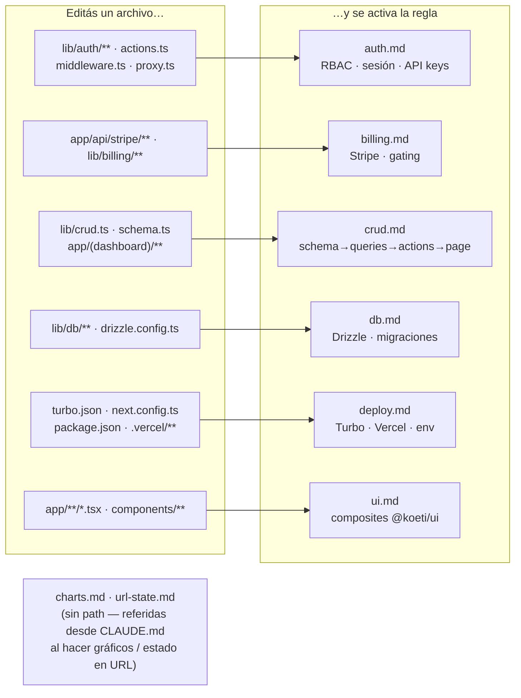

## 13. Workflow autónomo — el loop `/factory` (7 fases, cero preguntas)

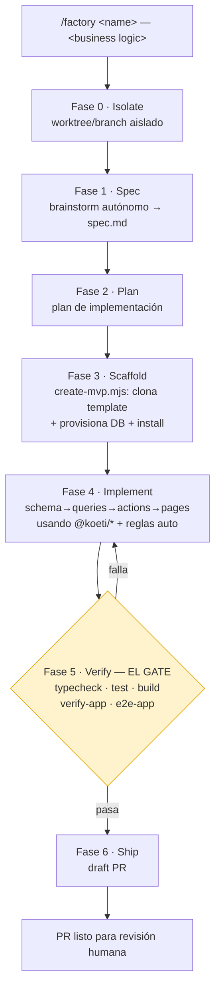

**El gate (Fase 5) es la Definition of Done** — nada sale sin que pase.
`/create-saas` es la variante que arranca en Fase 4 cuando un humano ya escribió
spec+plan. Tras evolucionar el template, `/port-template-change` re-corre el
gate en cada app para que ninguna quede atrás.

## 14. Mapa de comandos (el día a día del dev)

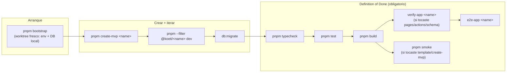

Regla de cierre: **antes de decir que algo funciona**, `typecheck && test &&
build` verde. Tocaste pages/actions/schema → sumá `verify-app` + `e2e-app`.
Tocaste `saas-template` o `create-mvp.mjs` → sumá `smoke`.
